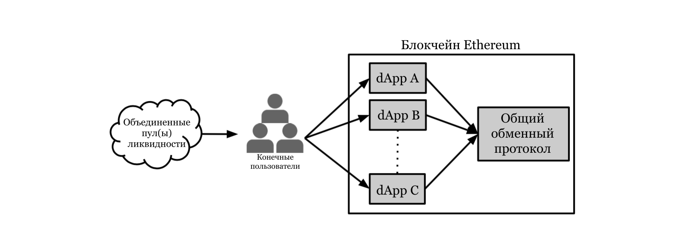
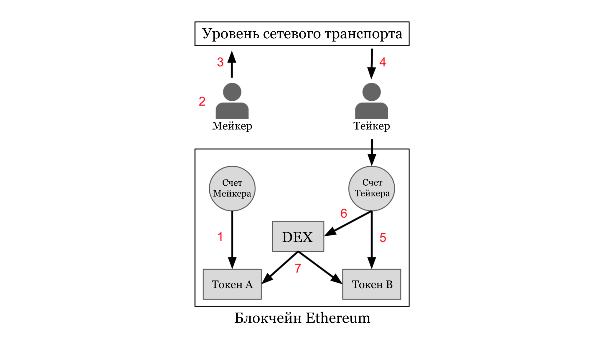
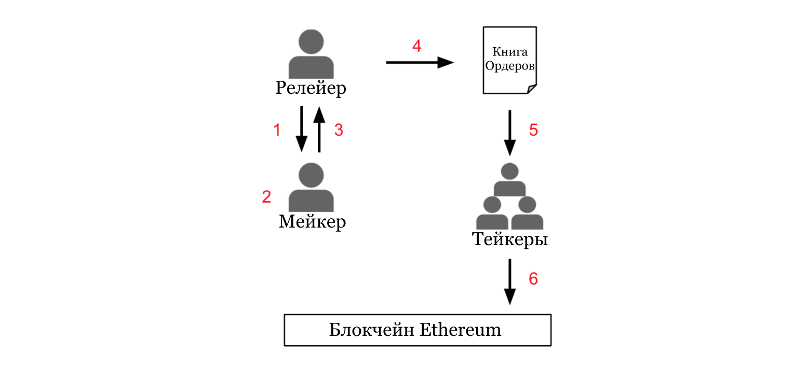
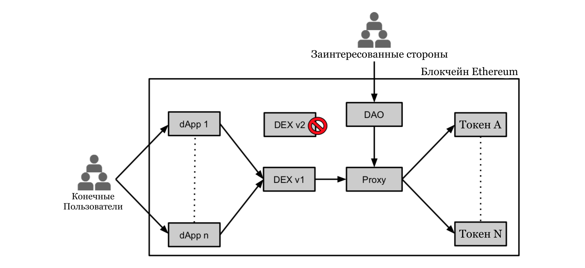

### 0x: Открытый протокол для децентрализованного обмена на блокчейном сети Ethereum
> Авторы: Will Warren, Amir Bandeali. Переводчик: Ivan Istomin
>
> [0xProject.com](https://0xproject.com)

#### 21 Февраля, 2017 года

##### Резюме

Мы описываем протокол, который облегчит обмен в среде одноранговых сетей токенами ERC20 на блокчейне Ethereum. Протокол представлен как открытый стандарт и общий строительный блок, обеспечивающий взаимодействие между децентрализованными приложениями (dApps), которые включают функциональные возможности обмена. Торги выполняются системой интеллектуальных контрактов Ethereum, которые являются общедоступными, бесплатными, любой, т. н. dApp может подключиться к ним подключиться. DApps, построенные на основе протокола, могут получить доступ к публичным пулам ликвидности или создать собственный пул ликвидности и оплатить транзакционные сборы за результирующий объем. Протокол равноправен к каждому участнику: он не накладывает расходов на своих пользователей или произвольно извлекает ценность из одной группы пользователей, чтобы принести пользу другой. Децентрализованное управление используется для непрерывной и надежной интеграции обновлений в базовый протокол без нарушения dApps или конечных пользователей.

### Содержание

[TOC]

## 1. Введение

Блокчейн был и остается революцией в сфере финансов, позволяя кому-либо владеть или передавать активы через открытую финансовую сеть без необходимости доверять третьей стороне. Теперь, когда существуют [сотни активов][1] на основе blockchain, и каждый месяц добавляется все больше, необходимость обмена этими активами усугубляется. С появлением смарт-контрактов две или более сторон, могут обмениваться активами blockchain без необходимости доверять третьей стороне.

Децентрализованный обмен является важным шагом вперед, по сравнению с экосистемой централизованных обменов по нескольким ключевым причинам: децентрализованные обмены могут обеспечить более надежные гарантии безопасности для конечных пользователей, так как больше нет центральной партии, которая может быть взломана, убежать с клиентскими средствами или подвергнуться правительственным правилам. Взломы [*Мt. Gox*][2], [*Shapeshift*][3] и *Bitfinex* продемонстрировали, что эти типы системных рисков ощутимы. Децентрализованный обмен позволит устранить эти риски, позволяя пользователям совершать сделки без доверия - без посредника - и возлагая бремя безопасности на отдельных пользователей, а не на одного хранителя.

За два года, прошедшие со времени создания генесис (первого) блока блокчейна Ethereum, многочисленные децентрализованные приложения (dApps) создали смарт-контракты Ethereum для P2P обмена. Быстрое повторение однотипных практик и отсутствие лучших из них, оставили блокчейн разбросанным с собственными и специфичными для приложений реализациями. В результате, конечные пользователи подвергаются воздействию многочисленных смарт-контрактов различного качества, безопасности, уникальными процессами конфигурации и кривыми обучениями, все из которых реализуют ту же функциональность. Этот подход накладывает ненужные расходы на сеть, формируя конечных пользователей в соответствии с конкретным приложением, которое каждый пользователь использует, уничтожая ценные сетевые эффекты вокруг ликвидности.

**0x** — это открытый протокол для децентрализованного обмена на блокчейне Ethereum. Он предназначен для использования в качестве основного строительного блока, который может быть объединен с другими протоколами для управления все [более сложными dApps][4]. **0x** использует общедоступную систему смарт-контрактов, которая может выступать в качестве общей инфраструктуры для различных dApps, как показано на *рис. 1*. В долгосрочной перспективе, открытые технические стандарты, как правило, выигрывают над закрытыми, и поскольку каждый месяц на блокчейне токенизируется больше активов, мы увидим больше dApps, которые требуют использования этих разных токенов. В результате, открытый стандарт для обмена имеет решающее значение для поддержки этой открытой экономики.



Рис. 1: Открытые протоколы должны быть доступны любым типам приложений. Разбиение уровней приложения обеспечивает взаимную выгоду для разработчиков dApp и конечных пользователей в целом.


## 2. Проделанная работа

Децентрализованные биржи, реализованные с помощью смарт-контрактов Ethereum, не смогли генерировать значительный объем из-за неэффективности их модели, которые накладывают высокие фрикционные заптраты на маркет-мейкеров. В частности, эти реализации размещают свои книги заказов[^1] на блокчейне ([5][5], [6][6], [7][7], [8][8]), требуя от маркет-мейкеров тратить газ каждый раз, когда они размещают, изменяют или отменяют заказ. Хотя стоимость одной сделки невелика, часто изменение  Ордеров в ответ на меняющиеся рыночные условия является непомерно дорогостоящим. В дополнение к высоким издержкам для маркет-мейкеров, ведение книги Ордеров по цепочке приводит к транзакциям, которые потребляют пропускную способность сети и раздувают блокчейн, без необходимости в результате ценности транзакции.

Смарт-контракты *Automated market maker (AMM)* предлагаются ([9][9], [10][10]) в качестве альтернативы книге Ордеров в цепи. Смарт-контракт *AMM* заменяет книгу Ордеров моделью корректировки цены, в которой спотовая цена актива детерминированно (предопределенно) реагирует на рыночные силы и участников рынка по обе стороны от рыночной торговли с *AMM*, а не друг с другом. Преимущества *AMM* включают в себя доступность (он всегда доступен в качестве контрагента, хотя спотовая цена, которую он предлагает, может быть хуже, чем то, что можно получить от более традиционной биржи) и легкость интеграции с внешними смарт-контрактами, которые должны выполнять рыночные заказы. Детерминированная природа цен — корректировка моделей делают их нечувствительными к рыночной ликвидности, это означает, что сделки заставляют цены двигаться ту же сумму в толстых и тонких рынков [11][11]. Другими словами, *AMM* накладывают искусственные ограничения на кривую предложения. Если модель корректировки цены слишком чувствительна, даже небольшие сделки приведут к большим колебаниям спотовой цены. Если модель корректировки цен недостаточно чувствительна, банкролл *AMMs* будет быстро исчерпан арбитрами.

Каналы состояния предлагаются в качестве средства масштабирования блокчейна Ethereum и снижения затрат для различных приложений, включая биржи [12][12], путем перемещения транзакций из блокчейна ([13][13], [14][14]). Участники в канале состояния передают криптографически подписанные сообщения туда и обратно, накапливая промежуточные изменения состояния без публикации их в каноническую цепочку, пока канал не будет закрыт. Каналы состояний идеально подходят для приложений "Bar tab", где многочисленные промежуточные изменения состояния могут накапливаться вне цепочки, прежде чем быть урегулированы одной транзакцией по цепочке (т. е. дневная торговля, покер, пошаговые игры). Если один из участников канала покидает канал или пытается обмануть, существует период оспаривания, в течение которого другой участник может опубликовать самое последнее сообщение, полученное от преступника. Из этого следует, что участники канала всегда должны быть *online*, чтобы бросить вызов нечестному контрагенту, и поэтому участники уязвимы для *DDOS-атак*. Пока каналы состояния резко сокращают количество операций на-цепи для конкретных случаев использования, многочисленные транзакции и страховые депозиты на-цепи требуется для открытия и безопасного закрытия канала состояния, что делает их неэффективными для разовых сделок.

Гибридная реализация, которую мы называем “ретрансляцией заказа вне цепи с расчетами по-цепи", снижает эффективность каналов состояния при ближайшем мгновенном расчете книг Ордеров на-цепи. При таком подходе криптографически подписанные Ордера транслируются из блокчейна; заинтересованный Контрагент может ввести один или несколько из этих ордеров в смарт-контракт для выполнения сделок без доверия, непосредственно на блокчейне ([15][15], [16][16]). Затраты на трение (затраты, как предполагаемые, так и прямые, связанные со сделкой. Такие расходы включают время, усилия, деньги и связанные с ними налоговые последствия сбора информации и совершения сделки) минимизируются для маркет-мейкеров, поскольку они могут сигнализировать о намерениях вне-цепи, а транзакции происходят только при передаче стоимости. Мы расширяем этот подход, позволяя любому действовать в качестве обменника и делая протокол доступным любым типам приложений.


## 3. Спецификация

На *рис. 2* представлена общая последовательность шагов, используемых для ретрансляции заказа вне цепи и расчета внутри цепи. Пока мы игнорируем некоторые механизмы, которые станут важными позже.



Рис. 2: Вне-цепи ретрансляторы, на-цепи схема расчетов. Серые прямоугольники и круги представляют смарт-контракты и счета Ethereum. Стрелки, указывающие на смарт-контракты Ethereum, представляют вызовы функций; стрелки направлены от вызывающего абонента к вызываемому абоненту. Смарт-контракты могут вызывать функции у других смарт-контрактов. Стрелки, не входящие в зону блокчейна Ethereum, представляют информационный поток.

1. Мейкер утверждает контракт децентрализованной биржи (DEX) для доступа к их балансу Токена A[^2].

2. Мейкер создает Ордер на обмен Токена A на Токен B, указывая желаемый курс обмена, срок действия (по истечении которого Ордер не может быть выполнен) и подписывает Ордер своим закрытым ключом. 

3. Мейкер транслирует заказ по любому произвольному средству связи. 

4. Тейкер перехватывает заказ и решает, что он хотел бы его выполнить. 

5. Тейкер утверждает контракт DEX для доступа к балансу Токена B. 

6. Тейкер выносит подписанный Мейкером Ордер DEX контракту.

7. Контракт DEX проверяет подлинность подписи создателей, проверяет, что заказ не истек, проверяет, что заказ еще не был выполнен, затем производит обмен токенов между двумя сторонами по указанному обменному курсу.


#### 3.1 Формат сообщения

Каждый Ордер представляет собой пакет данных, содержащий параметры заказа и соответствующую подпись. Параметры заказа объединяются и хэшируются до 32 байт с помощью функции Keccak SHA3. Инициатор Ордера подписывает хэш заказа своим закрытым ключом для создания подписи ECDSA.


##### 3.1.1 Ордера «От точки до точки»

Для совершения сделки между двумя лицами Ордеры позволяют напрямую обмениваться токенами между собой, используя практически любой канал связи, который они предпочитают передавать сообщения. Пакет данных, который составляет Ордер, составляет несколько сотен байтов hex, которые могут быть отправлены по электронной почте, сообщению Facebook, whisper или любой другой аналогичной службой обмена данными. Заказ может быть заполнен только по указанному адресу получателя, что делает заказ бесполезным для подслушивающих или посторонних лиц.

| Название     | Тип данных | Описание                                                     |
| :----------- | ---------- | ------------------------------------------------------------ |
| `version`    | `address`  | `Адрес смарт-контракта биржи.Этот адрес будет меняться при каждом обновлении протокола.` |
| `maker`      | `address`  | `Адрес источника заказа.`                                    |
| `taker`      | `address`  | `Адрес разрешен для заполнения заказа`                       |
| `tokenA`     | `address`  | `Адрес контракта Токена ERC20`                               |
| `tokenB`     | `address`  | `Адрес контракта Токена ERC20`                               |
| `valueA`     | `uint256`  | `Всего единиц токенов A, предлагаемых maker'ом`              |
| `valueB`     | `uint256`  | Общее количество маркеров B по просьбе создателя.            |
| `expiration` | `uint256`  | `Время истечения срока действия ордера (секунды с эпохи unix)` |
| `v`          | `uint8`    | `Подпись ECDSA`                                              |
| `r`          | `bytes32`  | `вышеуказанных`                                              |
| `s`          | `bytes32`  | `аргументов.`                                                |

Таблица 1: Формат сообщения для Ордера «От точки до точки».


##### 3.1.2 «Широкоформатные» Ордера

Для появления ликвидных рынков должны существовать публичные места, где покупатели и продавцы могут размещать заказы, которые впоследствии объединяются в книги Ордеров, т. е. биржи. Создание и эксплуатация биржи обходится дорого, и протокол, который мы описали до сих пор, не дает стимула для кого-то брать на себя такие расходы. «Широкоформатные» Ордера решают эту проблему, позволяя любому действовать в качестве обмена, поддерживать книгу Ордеров (публичную или частную) и взимать плату за транзакции со всей полученной ликвидности. Мы обращаемся к сущности, размещения и поддержания портфеля заказов по состоянию Ретрансляторов, а не обмена. Где обменники должны построить и управлять собственной инфраструктурой, исполнять сделки и управлять средствами пользователей, Ретрансляторы лишь облегчают сигнализации между участниками рынка хостинга и распространение книги, которая состоит из универсальных Сообщений. Ретрансляторы не совершают сделки от имени участников рынка, так как это потребует от участников рынка доверять Ретрансляторам. Вместо этого, `Takers` выполняют свои собственные сделки.

Формат сообщений для заказов на вещание включает два изменения формата  «От точки до точки» для облегчения общественного обмена и стимулирования Ретрансляторов. Во-первых, в «широкоформатных» Ордерах не указывается адрес `taker` (получателя), что позволяет любому, кто его перехватит, заполнить «широкоформатный» Ордер. Во-вторых, «широкоформатные» Ордера включают `feeA`, `feeB` и `feeRecipient`, параметры получателя комиссии, которые определяют значения комиссии за транзакцию и адрес, используемый Ретранслятором для сбора комиссии за транзакцию. Смарт-контракт обменника передает эти сборы получателю комиссии, если Ордер выполнен. На *рис. 3* представлена последовательность шагов, которые `Makers` и Ретрансляторы используют для переговоров о транзакционных сборах без доверия.



Рис. 3: Ретранстляторы размещают и обслуживают вне-цепи книгу Ордеров в обмен на комиссионные. Эта Диаграмма иллюстрирует ретрансляцию заказов вне цепочки и последовательность шагов, используемых `Makers` и Ретрансляторами для согласования транзакционных сборов без доверия. Транзакционные сборы перемещаются от `Maker` и/или принимаются к Ретранслятору при расчете сделки, расширяя процесс расчетов по-цепи, показанный на *Рис. 2*. 

1. Ретранслятор ссылается на график сборов и адрес, который они используют для сбора комиссий за транзакции. 
2. `Maker` создает Ордер, устанавливая `feeA` и `feeB` те вещи, которые удовлетворяют графику сборов Ретранстляторов, устанавливая `feeRecipient` на желаемый адрес получения Ретранслятором и подписывает заказ своим личным ключом. 

3. `Maker` передает подписанный Ордер компании Ретранслятору.
4. Ретранслятор получает заказ, проверяет, что Ордер действителен и что он предоставляет необходимые сборы. Если Ордер недействителен или не соответствует требованиям Ретранслятора, заказ отклоняется. Если Ордер удовлетворителен, Ретранслятор отправляет заказ в свою книгу заказов. 

5. `Takers` получают обновленную версию книги Ордеров, которая включает `Maker’s` Ордера.
6. `Taker` выполняет `Maker’s` Ордера подав его в биржевой контракт на блокчейн Ethereum.

| Название        | Тип данных | Описание                                                     |
| --------------- | ---------- | ------------------------------------------------------------ |
| `version`       | `address`  | `Адрес смарт-контракта биржи.`                               |
| `maker`         | `address`  | `Адрес источника (мейкера) заказа.`                          |
| `tokenA`        | `address`  | `Адрес контракта ERC20 Токена A.`                            |
| `tokenB`        | `address`  | `Адрес контракта ERC20 Токена B.`                            |
| `valueA`        | `uint256`  | `Общее количество токенов A, предлагаемых мейкером.`         |
| `valueB`        | `uint256`  | `Общее количество токенов B запрошенных мейкером.`           |
| `expiration`    | `uint256`  | `Время истечения срока действия ордера (секунды с эпохи unix).` |
| `feeRecipient ` | `address`  | `Адрес ретранслятора. Получает комиссионные.`                |
| `feeA`          | `uint256`  | `Общее количество токенов в протоколе, которое Maker платит feeRecipient.` |
| `feeB`          | `uint256`  | `Общее количество токенов в протоколе, которое Taker платит feeRecipient.` |
| `v`             | `uint8`    | `Подпись ECDSA`                                              |
| `r`             | `bytes32`  | `вышеуказанных`                                              |
| `s`             | `bytes32`  | `аргументов.`                                                |

Таблица 2: Формат сообщения для «Широкоформатные» Ордера.

Хотя может показаться странным, что `Maker` указывает комиссии за транзакцию, имейте в виду, что Ретрансляторы в конечном итоге контролируют, какие заказы публикуются. Поэтому, если `Maker` хочет, чтобы его заказ был занесен в определенную книгу Ордеров, он должен задать `feeA`, `feeB` и `feeRecipient` для значений, удовлетворяющих Ретранслятору, связанному с этой книгой Ордеров. Так как сборы обговариваются вне-цепи, Ретрансляторы могут изменять график сборов динамически и по своему усмотрению (для входящих заказов, которые еще не были подписаны, а не для существующих заказов). Ретрансляторы могут использовать информацию, которая доступна на-цепи или вне-цепи для установки и корректировки сборов, что позволяет делать гибкие комиссии (плоские сборы, процент на основе, объем на основе, многоуровневые, модели подписки, и т.д.). Однако, как только Ретранслятор принял Ордер в свою книгу Ордеров, стоимость Ордера не может быть изменена.

Обычные биржи используют механизм сопоставления для заполнения рыночных заказов от имени своих пользователей, и пользователи должны доверять тому, что биржа предоставит им наилучшую доступную цену. Как правило, пользователи могут быть уверены в том, что эти регулируемые объекты будут привлечены к ответственности, если они попытаются обмануть или в случае неисправности соответствующая часть системы неисправна не выполнить обязательств. Для **0x**-протоколе остается недоверчивым тот факт, что, Ретрансляторам не может быть предоставлена возможность исполнять Ордера от имени `Maker` и `Taker`. Вместо этого, Ретрансляторы могут только рекомендовать лучшую доступную цену тем, кто должен самостоятельно решить подписать и отправить транзакцию в блокчейн. Это означает, что протокол **0x** не может поддерживать истинные рыночные ордера, однако хорошо разработанное веб-приложение может приблизить этот тип посредством хорошо разработанного и отзывчивого веб-интерфейса.

Важно признать, что адрес `feeRecipient` может указывать на любой произвольный смарт-контракт. Это означает, что сложные структуры стимулирования Ретранслятора могут быть "подключены"к протоколу 0x. Например, контракт `feeRecipient` может быть разработан для разделения транзакционных сборов между несколькими Ретрансляторами или распределения транзакционных сборов по Swarm (рою) узлов в соответствии с уровнем вклада каждого узла в распространение книги Ордеров в цензурно-устойчивой сети P2P[^3].


#### 3.2 Смарт-контракт (умный контракт)

Протокол обмена реализован в рамках смарт-контракта Ethereum, который является общедоступным и бесплатным для использования (никакие дополнительные расходы не накладываются на пользователей сверх стандартных затрат на газ). Он написан на языке программирования *Solidity* и содержит две относительно простые функции: `fill` и `cancel`. Весь контракт составляет приблизительно 100 строк кода, и это стоит приблизительно 90 тыс. газа, чтобы выполнить Ордер.


##### 3.2.1 Аутентификация подписи

Смарт-контракт реализующий обмен, способен проверить подлинность создателя Ордера (`Maker`) подпись используется функцией `ecrecover`, которая берет *хэш* и *хэш подписи* в качестве аргументов и возвращает публичный ключ, который представляет из себя подпись. Если функция `ecrecover` вернула публичный ключ равный адресу `Maker`, значит подпись подлинна.

```javascript
                  address publicKey = ecrecover( hash, signature( hash ) );
                           if ( publicKey != maker ) throw;
```


##### 3.2.2 Заполнения и частичные заполнения

Смарт-контракт биржи хранит ссылку на каждый ранее заполненный Ордер, чтобы предотвратить многократное заполнение одного заказа. Эти ссылки хранятся в сопоставлении; структура данных, которая в данном случае сопоставляет 32-байтовый блок данных с 256-битным целым числом без знака. Передача параметров, связанных с порядком, в функцию Keccak SHA3 создает уникальный 32-байтовый хэш, который может использоваться для уникальной идентификации этого порядка (вероятность столкновения хэша, нахождения двух разных порядков с одинаковым хэшем, практически равна нулю, т. е. коллизия). Каждый раз, когда Ордер выполнен, сопоставление хранит хэш заказа и заполненное кумулятивное (накопленное) значение.

`Taker` может частично выполнить (заполнить) Ордер, указав дополнительный аргумент `valueFill` при вызове функции заполнения смарт-контракта биржи. Несколько частичных заполнений могут быть выполнены по одному Ордеру, если сумма частичных заполнений не превышает общую стоимость Ордера.

| Название    | Тип данных | Описание                                                     |
| ----------- | ---------- | ------------------------------------------------------------ |
| `valueFill` | `uint256`  | `Общее количество единиц токенов, подлежащих обмену (valueFill ≤ valueA).` |

Таблица 3: Тейкеры должны предоставить дополнительный аргумент при попытке выполнить Ордер.


##### 3.2.3 Срок действия

Срок действия Ордера определяет `Maker` в момент его подписания. Время истечения срока действия — это целочисленное значение без знака, представляющее абсолютное число секунд с эпохи unix. Это значение нельзя изменить после подписания. 

Время в виртуальной машине Ethereum задается отметками времени блока, которые устанавливаются каждый раз, когда новый блок добывается. Таким образом, статус истечения срока действия ордера не зависит от времени, в которое `Taker` передает свое намерение заполнить Ордер, а зависит от времени, в которое функция заполнения выполняется в *EVM (Виртуальной Mашине Ethereum)* майнером. Майнер не может установить отметку времени (`timestamp`) блока текущего блока раньше, чем отметка времени предыдущего блока.


##### 3.2.4 Закрытие Ордера

Неисполненный и неистекший Ордер может быть отменен соответствующим `Maker` с помощью функции отмены смарт-контракта биржи. Функция `cancel` сопоставляет хэш Ордера с максимальным значением Ордера (`valueA`), предотвращая последующее выполнение. Отмена Ордера стоит газа и, соответственно, функция отмены предназначена только для использования в качестве резервного механизма. Как правило, `Makers` должны избегать транзакций по цепочке, устанавливая время истечения их Ордеров в соответствии с частотой, с которой они намерены обновлять свои Ордера.

Одна из проблем с этим подходом заключается в том, что он может создавать ситуации, когда `Maker` пытается отменить свой Ордер примерно в то же время, когда `Taker` пытается заполнить тот же самый Ордер. Одна из двух сторон сделки потерпит неудачу, тратя газ, в зависимости от последовательности, в которой две сделки добываются. Неопределенность в отношении последовательности, в которой разрабатываются сделки, может иногда приводить к нежелательным результатам. Эта неопределенность может увеличиться, если блокчейн Ethereum столкнется со значительным отставанием отложенных транзакций.  


## 4. Протокол токена

Криптоэкономические протоколы создают финансовые стимулы, которые управляют сетью рациональных экономических агентов для координации их поведения в направлении завершения процесса ([4][4], [17][17], [18][18]). В то время как **0x** в основном является сетевым протоколом, используемым для облегчения сигнализации между покупателями и продавцами (а не криптоэкономическим протоколом), он предназначен для использования в качестве открытого стандарта для dApps, которые включают функциональность обмена. Установление и поддержание открытого стандарта — это проблема координации, которая увеличивает операционные издержки для всех участвующих сторон; координация может быть особенно сложной задачей, когда каждая сторона имеет различные потребности и финансовые стимулы. Токены протокола могут выравнивать финансовые стимулы и компенсировать затраты, связанные с организацией нескольких сторон вокруг одного технического стандарта. В то время как выравнивание стимулов вокруг принятия полезно, токены протокола могут быть использованы для решения гораздо более сложной проблемы: будущая проверка протокола, реализованного в неизменяемой системе смарт-контрактов через децентрализованное управление.


#### 4.1 Децентрализованное Управление (Государтсво)

##### 4.1.1 Непрерывная интеграция

Как только смарт-контракт Ethereum развертывается в блокчейн, его внутренняя логика не может быть изменена. Поэтому для обновления протокола необходимо развернуть совершенно новый смарт-контракт, который либо разветвляет сеть, либо прерывает работу пользователей и процессов, зависящих от протокола, до тех пор, пока они не перейдут на новую версию. В контексте биржи обновление разрушительного протокола может привести к аннулированию всех открытых Ордеров и потребовать от каждого участника рынка Утвердить новый смарт-контракт для доступа к своим торговым балансам. Изначально протокол может быть разделен на две версии, которые работают параллельно, нейтрализуя сетевые эффекты, создаваемые взаимодействием dApp. Хотя абстракция смарт-контрактов может использоваться для непрерывного внедрения обновлений в протокол без нарушения процессов более высокого уровня, такой механизм обновления может также создавать значительные риски для безопасности конечных пользователей (в худшем случае злоумышленник может получить доступ к средствам пользователей). Токены протокола могут использоваться для управления децентрализованным механизмом обновления, который обеспечивает непрерывную интеграцию обновлений в протокол, а также защиту пользователей и заинтересованных сторон протокола.

**0x** будет развернут в блокчейн Ethereum с фиксированной поставкой токенов протокола, которые будут выпущены для партнеров dApps и будущих конечных пользователей. Токены протокола будут иметь два применения: для участников рынка, для оплаты транзакционных сборов Ретрансляторами и для децентрализованного управления обновлениями протокола. Децентрализованное управление будет использоваться для безопасной интеграции обновлений в протокол **0x** в соответствии с процессом, показанным на *рис. 4*. Первоначально простой контракт с несколькими подписями будет использоваться для децентрализованного управления до тех пор, пока не будет разработано более сложное DAO. Протокол **0x** и ее родной знак не будет навязывать ненужных затрат на пользователей, стремятся арендовать или извлекать выгоду из Ретрансляторов. Смарт-контракты протокола будут общедоступными и полностью бесплатными для использования. Никакие механизмы не будут использоваться в интересах одной группы за счет другой.



Рис. 4: Обновления протокола могут быть развернуты без нарушения работы сети посредством сочетания абстракции контрактов и децентрализованного управления. Конечные пользователи предоставляют прокси-контракт с доступом к токенам, которые они планируют торговать. Заинтересованные стороны предлагают и выбирают улучшения протокола, которые реализуются в рамках совершенно новых смарт-контрактов (DEX v2) через DAO. DAO разрешает новым смарт-контрактам получать доступ к пользовательским токенам, добавляя их в белый список прокси-контракта и, в конечном счете, отменяя устаревшие версии протокола.


##### 4.1.2 Реестр Токенов

Ордеры состоят из шестнадцатеричного байт-кода, который является машиночитаемым, но это не обязательно легко для человека, чтобы визуально интерпретировать. Контракт реестра токенов[^4] будет использоваться для хранения списка токенов ERC20 со связанными метаданными для каждого токена: имя, символ, адрес контракта и количество десятичных знаков, необходимых для представления наименьшей единицы токена (необходимой для определения валютных курсов). Реестр будет служить официальным справочником по-цепи, который может использоваться участниками рынка для независимой проверки адресов токенов и обменных курсов до совершения сделки. Поскольку реестр Токенов будет служить надежным источником информации, необходимо будет добавить, изменить или удалить токены из реестра. **0x** заинтересованные стороны обеспечат этот надзор. В то время как реестр Токенов позволит пользователям легко проверить целостность своих заказов, протокол **0x** может быть использован для торговли любым токеном, который использует интерфейс токенов ERC20.

В будущем, протокол формата Ордера может быть изменен для облегчения его читаемости. Маркеры могут быть идентифицированы трехсимвольным символом, зарегистрированным в реестре маркеров, а не адресом контракта маркера. В системе имен Эфириума (*Ethereum Name Service — ENS*) может быть использован для выявления `Makers`, `Takers` и Ретрансляторов на удобочитаемые имена, такие как “theDunkle.eth", а не по адресу счета или договора.


## 5. Резюме

- Ретрансляция Ордеров вне-цепи + всевозможные урегулирования в-цепи = низкие затраты на трение + быстрое урегулирование. 
- Общедоступные смарт-контракты, к которым может подключиться любое приложение. 
- Ретрансляторы могут создавать свои собственные пулы ликвидности и взимать комиссии за транзакции по объему. 
- Стандартизация + разделение = [Общий протокол уровня](https://github.com/0xProject/standard-relayer-api/blob/master/README.md) →
   - обеспечивает взаимодействие между приложениями
   - создает сетевое влияние вокруг ликвидности, которые являются взаимовыгодными
   - снижает барьеры для входа, снижая затраты для участников рынка
   - исключает дублирование, улучшает опыт потребителя и умную обеспеченность подряда 
- Децентрализованный механизм обновления позволяет постоянно и безопасно интегрировать улучшения в протокол, не нарушая работу dApps или конечных пользователей. 


## 6. Выражение благодарностей

Мы хотели бы выразить благодарность нашим наставникам, советникам и многим людям в сообществе Ethereum, которые были так приветливы и щедры своими знаниями. В частности, мы хотели бы поблагодарить Joey Krug, Linda Xie и Fred Ehrsam за обзор, редактирование и предоставление отзывов об этой работе. Мы также хотели бы поблагодарить организаторов и членов сообщества, которых мы встретили на встрече Ethereum Meetup в Силиконовой долине, включая Joseph Chow, Martin Koppelmann, Rebecca Migirov, Gustav Simonsson, Grant Hummer, Tom Ding и сотрудников String Labs и многих других.

## 7. Приложение

[^1]: Книга заказов используется для публичного учета интереса покупателей и продавцов к конкретному финансовому инструменту. Каждая запись включает ссылку на заинтересованную сторону, количество акций и цену, которую покупатель или продавец предлагают/просят за конкретное обеспечение.
[^2]: Смотрите токен стандарта ERC20 в приложении. Возможно предоставить одобрение один раз и выполнять неограниченное количество сделок. А можно иначе, один может предоставить одобрение до, и играничиваться ценностью сделки, каждый индивидуальный перевод.
[^3]: Разработка протокола ретрансляции с низкой задержкой, поддерживающего полностью распределенную книгу заказов, рассматривается на следующем этапе этого проекта.
[^4]: https://github.com/ethereum/EIPs/issues/22 


#### 7.1 Токен стандарта ERC20

[ERC20](https://github.com/ethereum/EIPs/blob/master/EIPS/eip-20.md) устанавливает стандартный контракт ABI для токенов на блокчейне Ethereum и стал де-факто стандартом для всех типов цифровых активов. Токены ERC20 имеют один и тот же интерфейс контракта, что упрощает интеграцию с внешними контрактами.

Функциональное ядро токенов ERC20 включают в себя: 
- `transfer(to, value)` *— перевод(кому, кол-во)*
- `balanceOf(owner)` *— проверкаСчета(адресВладельца)*
- `approve(spender, value)` *— подтверждение(тратящий, кол-во)*
- `allowance(owner, spender)` *— выплата(владелец, тратящий)*
- `transferFrom(from, to, value)` *— перевестиОт(от кого, кому, кол-во)*

[EIP101](https://github.com/ethereum/EIPs/issues/28) включает предложение изменить, либо следовать стандарту токена ERC20. На данный момент смарт-контракт “обертка” может использоваться в качестве прокси для ERC20 Ether. Для справки, смотрите [реализацию Maker](https://github.com/makerdao/token-wrapper/blob/master/src/wrapper.sol) или [реализацию Gnosis](https://github.com/gnosis/gnosis-exchange). 


#### 7.2 ABI контракта

[EIP50](https://github.com/ethereum/EIPs/issues/50) предлагает продление контракта ABI для поддержки структур. Это позволит сообществу создавать стандартные структуры данных `Order` и `Signature`, упрощая интерфейс контракта и интеграцию с внешними контрактами. 


#### 7.3 Служба Имен Ethereum

[EIP137](https://github.com/ethereum/EIPs/blob/master/EIPS/eip-137.md) или [Служба Имен Ethereum (Ethereum Name Service — ENS)](https://media.readthedocs.org/pdf/ens/latest/ens.pdf) будет использоваться для разрешения удобочитаемых имен, таких как "my-name.eth" в машиночитаемые идентификаторы, которые могут представлять адреса Ethereum, Swarm и/или хэши контента IPFS или другие идентификаторы. Он также может использоваться для связывания метаданных с именами, такими как контракты ABI или whois информация. И будет использоваться протоколом 0x для создания более интуитивных форматов сообщений, которые опционально ссылаются на Мейкеров, Тейкеров и Ретрансляторов по имени.


### Источники

[1]: https://coinmarketcap.com/all/views/all/ "coinmarketcap | Последний доступ: 2017-02-16."
[2]: https://en.wikipedia.org/wiki/Mt._Gox "Wikipedia: Mt. Gox | Последний доступ: 2017-02-16."
[3]: https://info.shapeshift.io/blog/2016/04/19/timeline-shapeshift-hacking-incident "A Timeline: ShapeShift Hacking Incident | Последний доступ: 2017-02-16."
[4]: https://blog.0xproject.com/the-difference-between-app-coins-and-protocol-tokens-7281a428348c "Will Warren. The difference between App Coins and Protocol Tokens"
[5]: https://oasisdex.com "Maker Market | Последний доступ: 2017-02-01."
[6]: https://github.com/gitter-badger/etheropt.github.io "EtherOpt | Последний доступ: 2018-05-20."
[7]: https://dev.augur.net/ "Augur | Последний доступ: 2018-05-20."
[8]: https://www.reddit.com/r/ethereum/comments/5g0s8n/for_review_intrinsically_tradable_tokens_itts_are/ "Intrinsically Tradable Tokens | Последний доступ: 2017-02-01."
[9]: https://www.reddit.com/r/ethereum/comments/54l32y/euler_the_simplest_exchange_and_currency/ "Euler | Последний доступ: 2017-02-01."
[10]:  "Galia Benartzi Guy Benartzi, Eyal Hertzog. Bancor protocol: A hierarchical monetary system and the foundation of a global decentralized autonomous exchange. 2017."
[11]:  "Abraham Othman, David M Pennock, Daniel M Reeves, and Tuomas Sandholm. A practical liquidity-sensitive automated market maker. ACM Transactions on Economics and Computation, 1(3):14, 2013."
[12]: https://www.raidex.io "RaidEX | Последний доступ: 2017-02-14."
[13]: http://www.jeffcoleman.ca/state-channels/ "Jeff Coleman. State Channels | Последний доступ: 2017-02-14."
[14]: https://github.com/ledgerlabs/state-channels/wiki "Ledger Labs: State Channels Wiki | Последний доступ: 2017-02-14."
[15]: https://idex.market/ "IDEX, Decentralized Capital | Последний доступ: 2017-02-01."
[16]: https://etherdelta.com/ "EtherDelta | Последний доступ: 2017-02-01."
[17]: https://blog.coinbase.com/app-coins-and-the-dawn-of-the-decentralized-business-model-8b8c951e734f "Fred Ehrsam. App Coins and the dawn of the Decentralized Business Model"
[18]: https://blog.gdax.com/how-to-raise-money-on-a-blockchain-with-a-token-510562c9cdfa "Fred Ehrsam. How to Raise Money on a Blockchain with a Token"


